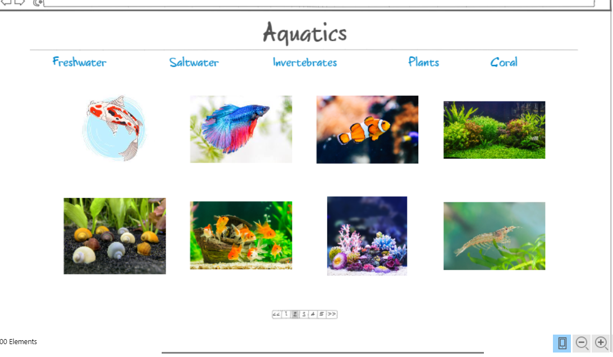
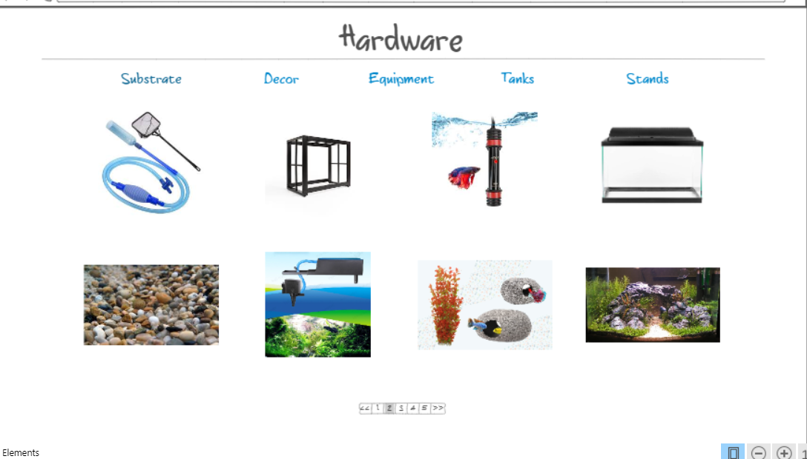
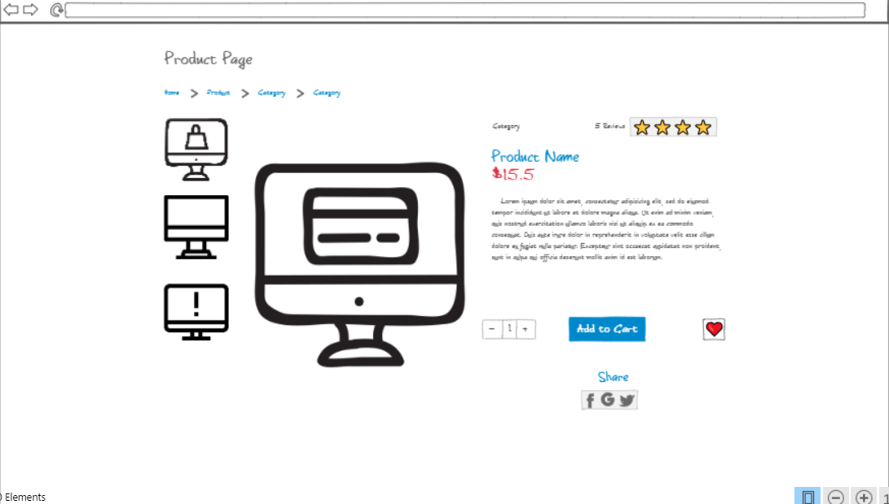
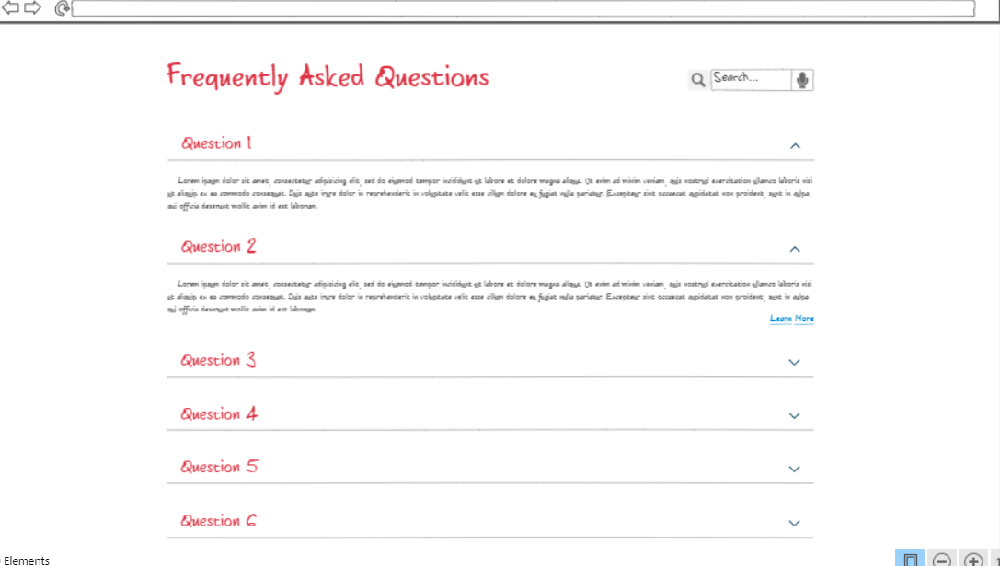

# Aquari(.com)

## Description Deliverable

### Elevator Pitch

Are you a passionate fishkeeper looking to take your aquatic hobby to the next level? Welcome to Aquari, the all-in-one website that empowers you to dive deeper into the enchanting world of aquariums!
With Aquari, you can effortlessly track and manage your diverse collection of aquatic wonders. Bring order to your underwater paradise, ensuring the optimal health and happiness of your finned friends. Say goodbye to the hassle of juggling notes and spreadsheets. Aquari streamlines your collection management, helping you monitor water parameters, feeding schedules, and health records with ease.
But that's just the beginning! Curious about which fish species harmonize together in the same tank? Our comprehensive compatibility database, backed by expert insights, will guide you towards creating a harmonious underwater ecosystem, minimizing stress and maximizing beauty.
And the icing on the cake? Our cutting-edge aquascape simulator lets you unleash your creativity. Design your dream tank layout, and experiment with different plants, decorations, and substrate options—all in a risk-free virtual environment. Watch your imagination come to life as you craft stunning aquascapes and perfect your aquatic masterpiece before implementing it in the real world.

### Design

Above is the live creatures section, and below is the equipment and tools section.

Next, we have a product page where customers can buy products.

Here is an FAQ page where fishkeepers can ask questions about the basics of fishkeeping.

### Key Features

- Secure login over HTTPS
- Users track their collection of fish tanks, which is stored in a database
- Users can see others' collections and profiles, and message each other to form a sense of community
- Users can make public posts and stream live videos of their collections
- Users can do research into fish compatibility, breeding, diseases and medications, etc to assure their tanks are as healthy as can be
- There will be an educational section for beginner fishkeepers
- Users can purchase live and inanimate products for their fish tanks
- Users can simulate fish tanks to see how they would look in the simulator

### Technologies

I am going to use the required technologies in the following ways.

- **HTML** - Uses correct HTML structure for application. Seven main HTML pages for the title screen, home screen, live products, inanimate products, product-specific/purchase screen, FAQ screen, and research directory. Hyperlinks to artifacts included for all selections.
- **CSS** - Application styling that looks good on different screen sizes, uses good whitespace, color choice and contrast.
- **JavaScript** - Provides login, purchasing functionality, forms the backbone of the design simulator, makes public posting functional, directs users to appropriate pages they click on, backend endpoint calls.
- **Service** - Backend service with endpoints for:
  - login
  - retrieving messages from other fishkeepers
  - recording new collection info to database
  - displaying public posts
  - calculating compatibility levels between fish
- **DB** - Store users, and the data on their collections such as water parameters, fish health, names, species and quantities of each they own, etc.
- **Login** - Register and login users. Credentials securely stored in database. Users who are not authenticated cannot log in, use the application or send messages to others' profiles
- **WebSocket** - Displays messages and public posts in real time
- **React** - Application ported to use the React web framework.

## HTML Deliverable

## CSS Deliverable

## JavaScript Deliverable

## Service Deliverable

## Database Deliverable

## Authentication Deliverable

## WebSocket Deliverable

## React Deliverable
